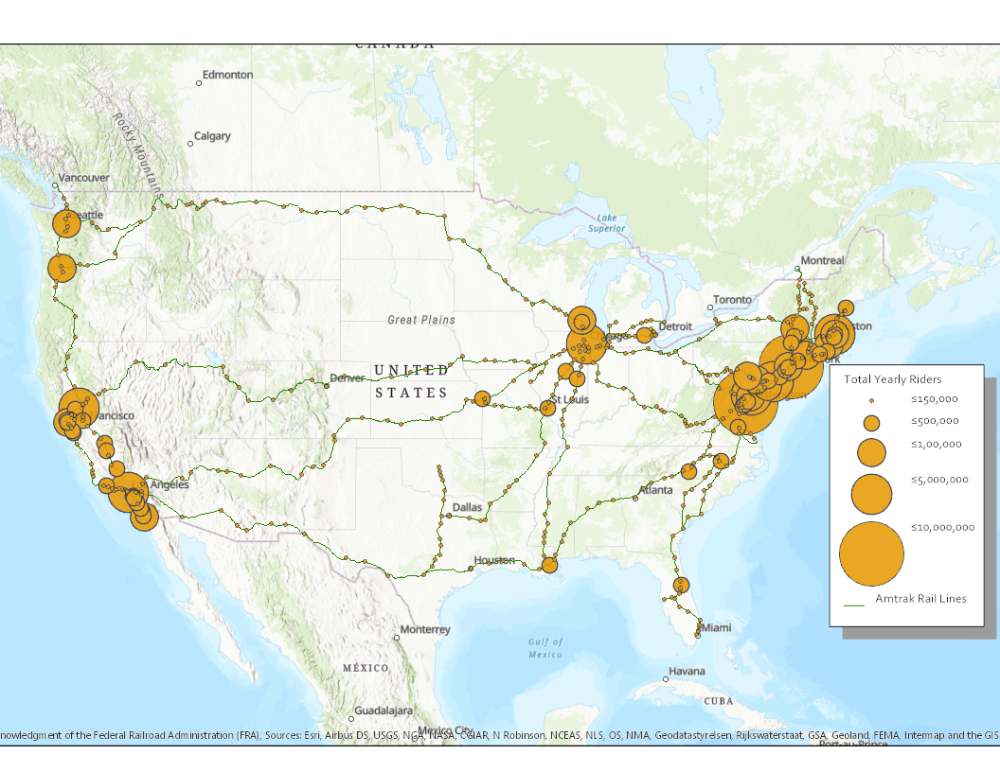

# Amtrak Web Scraper

This is a web scraper to download PDFs on Amtrak usage at stations across the U.S. from 2012-2018. Raw PDFs were downloaded at the station level and the state level (both csv's included here). From there, the program will scrape the graph for the last 6 years of ridership from each PDF document. Some stations have discontinued services in the last 6 years, and the program will flag these stations. Final data is posted as data visuals. 

# Data Visualization

Interactive visual of final dataset overlaid in U.S. is shown at [here.](https://ericenglin.github.io/Amtrak-Web-Scraper/Data-Visualization/Amtrak-2018.html) 

# Aberdeen Example
An example pdf is attached for Aberdeen, MD. Website with all raw pdf's: https://www.railpassengers.org/all-aboard/tools-info/ridership-statistics/

Here is a screenshot:

